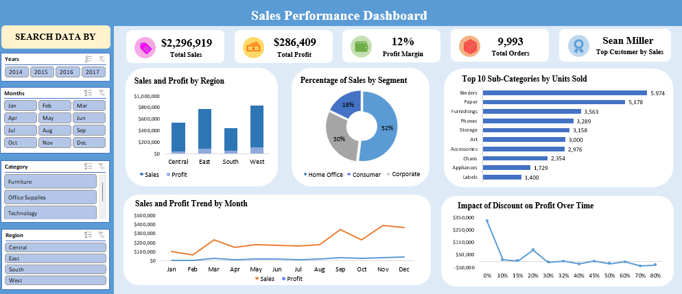

# Superstore Sales Analysis in Excel 

📌 Project Overview  
This project demonstrates end-to-end data analysis using **Microsoft Excel**, starting from data cleaning to building an interactive sales performance dashboard.
The dataset consists of **9,994 rows × 21 columns** of Superstore sales records, which required cleaning before building a dashboard for analysis.
___
📝 Data Cleaning Process
Before building the dashboard, I performed extensive data cleaning in Excel to ensure accuracy and consistency.

Key Steps:  
✅ **Split combined fields** into separate columns using *Text to Columns*.  
✅ **Convert range to Table (Ctrl+T)** for structured formatting and readability.  
✅ **Remove duplicates** and handle missing values using *Ctrl+G → Special → Blanks*.  
✅ **Standardize text entries** (remove extra spaces) with **Power Query**.  
✅ **Unify inconsistent date formats** into a single standardized format.  

🗂️ **Final Outcome:**  
A clean, structured, and standardized dataset ready for further analysis and dashboarding.  
___
📊 Dashboard Features  
Using the cleaned dataset, I designed an **interactive Excel dashboard** to explore sales performance.  

Key Features:  
✅ **Interactive Slicers** – filter by year, month, category, and region.  
✅ **KPI Highlights** – quick view of sales, profit, orders, and top customer.  
✅ **Regional Comparison** – side-by-side insights into performance by region.  
✅ **Customer Segments** – revenue contribution by segment.  
✅ **Sub-Category Breakdown** – identify top-selling product subcategories.  
✅ **Trend Analysis** – track sales, profit growth, and discount impact.  
✅ **Dynamic Filtering** – all charts update instantly with applied filters.

💡 Insights Gained  
☑️ **Consumer segment** contributes the largest share of revenue.  
☑️ **East & West regions** lead in sales performance.  
☑️ **Binders and Paper** dominate as top-selling subcategories.  
☑️ **Discounts above a certain threshold** reduce profitability.  
___
## 🖼️ Dashboard Preview  

⚙️ Tools Used  
Microsoft Excel (Power Query, PivotTables, Slicers, Dashboard Design)  
